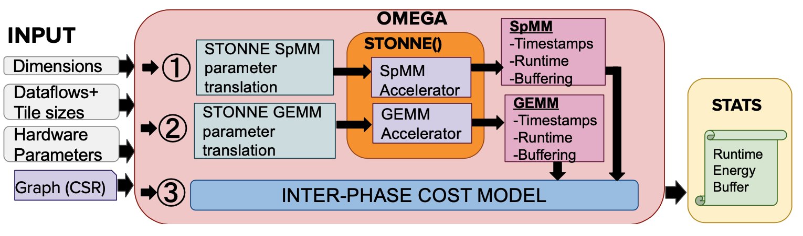

#### [HOME](README.md) &nbsp; &nbsp; &nbsp; &nbsp; &nbsp; [Features](FEATURE.md) &nbsp; &nbsp; &nbsp; &nbsp; &nbsp; [Documentation](DOCS.md) &nbsp; &nbsp; &nbsp; &nbsp; &nbsp; [ASPLOS 2022 Tutorial](ASPLOSTUT.md) &nbsp; &nbsp; &nbsp; &nbsp; &nbsp; [GNN-Dataflow](GNN.md)&nbsp; &nbsp; &nbsp; &nbsp; &nbsp;  [Codebase](https://github.com/stonne-simulator/stonne) &nbsp; &nbsp; &nbsp; &nbsp; &nbsp; [Resources](RESOURCES.md)


<h1 align=center>ASPLOS 2022 STONNE+OMEGA Tutorial</h1>

Date: 28th February 2022

## ORGANIZERS

[Francisco Muñoz-Martínez](https://www.linkedin.com/in/fr-munoz-mrtinez/) (Universidad de Murcia) <br>
[Raveesh Garg](https://www.linkedin.com/in/raveesh-garg-61b47b150/) (Georgia Institute of Technology) <br>
[Tushar Krishna](https://tusharkrishna.ece.gatech.edu) (Georgia Institute of Technology) <br>
[José L. Abellán](https://sites.google.com/ucam.edu/jlabellan/) (Universidad Católica de Murcia) <br>
[Manuel E. Acacio](https://webs.um.es/meacacio/) (Universidad de Murcia) <br>

## OVERVIEW

The design of specialized architectures for accelerating the inference procedure of Deep Learning (DL) is a booming area of research nowadays. 
While first-generation systolic-based accelerator proposals used simple fixed dataflows tailored for dense Deep Neural Networks (DNNs) applications, more recent architectures like MAERI or SIGMA have argued for flexibility to efficiently support a wide variety of layer types, dimensions, and sparsity. In addition, the recent appearance of Graph Neural Networks (GNNs) applications has resulted into multi-phase accelerators that combine the execution of multiple kernels in a pipelined manner, making the architectures much more complex. 

As the complexity of these accelerators grows, the analytical models currently being used for design-space exploration are unable to capture execution-time subtleties, leading to inexact results in many cases. This opens up a need for cycle-level simulation tools to allow for fast and accurate design-space exploration of DL accelerators, and rapid quantification of the efficacy of architectural enhancements during the early stages of a design. To this end, STONNE (Simulation Tool for Neural Network Engines) is a cycle-level microarchitectural simulation framework that can plug into any high-level DL framework as an accelerator device and perform full-model evaluation (i.e. we are able to simulate real, complete, unmodified DNN models) of state-of-the-art systolic and flexible DNN accelerators, both with and without sparsity support. STONNE is developed by the University of Murcia and the Georgia Institute of Technology and is open-sourced under the terms of the MIT license.

In this tutorial we demonstrate how STONNE enables research on DNNs accelerators by means of several use cases that range from the microarchitectural networks on-chip present in DNN accelerators to the scheduling strategies that can be utilized to improve energy efficiency in sparse accelerators. Further, we present OMEGA, another framework built on top of STONNE that enables the exploration of dataflows for accelerators for multi-phase GNN applications which are gaining popularity in the AI and HPC community.

<p align="center">
  <figure>
     
    <figcaption>STONNE Simulator Overview</figcaption>
</figure>
   <figure>
     
    <figcaption>OMEGA Framework Overview</figcaption>
</figure>
</p>

## SCHEDULE

## CODEBASES

### STONNE

https://github.com/stonne-simulator/stonne

### OMEGA
Coming soon

## PUBLICATIONS

### STONNE

Francisco Muñoz-Matrínez, José L. Abellán, Manuel E. Acacio, and Tushar Krishna. Stonne: Enabling cycle-level microarchitectural simulation for dnn inference accelerators.  In 2021 IEEE International Symposium on Workload Characterization (IISWC), 2021. [(pdf)](https://arxiv.org/pdf/2006.07137.pdf)

### OMEGA

Raveesh Garg, Eric Qin, Francisco Muñoz-Martínez, Robert Guirado, Akshay Jain, Sergi Abadal, José L Abellán, Manuel E Acacio, Eduard Alarcón, Sivasankaran Rajamanickam, and Tushar Krishna.  Understanding the design space of sparse/dense multiphase dataflows for mapping Graph Neural Networks on spatial accelerators. arXiv preprint arXiv:2103.07977, 2021. [(pdf)](https://arxiv.org/pdf/2103.07977)

## CITATIONS

If you use STONNE or OMEGA framework in your research. Please cite-

### STONNE

```
@INPROCEEDINGS{STONNE21,
  author =       {Francisco Mu{\~n}oz-Matr{\'i}nez and Jos{\'e} L. Abell{\'a}n and Manuel E. Acacio and Tushar Krishna},
  title =        {STONNE: Enabling Cycle-Level Microarchitectural Simulation for DNN Inference Accelerators},
  booktitle =    {2021 IEEE International Symposium on Workload Characterization (IISWC)}, 
  year =         {2021},
  volume =       {},
  number =       {},
  pages =        {},
}
```

### OMEGA

```
@article{garg2021understanding,
  title={Understanding the Design Space of Sparse/Dense Multiphase Dataflows for Mapping Graph Neural Networks on Spatial Accelerators},
  author={Garg, Raveesh and Qin, Eric and Mu{\~n}oz-Mart{\'\i}nez, Francisco and Guirado, Robert and Jain, Akshay and Abadal, Sergi and Abell{\'a}n, Jos{\'e} L and Acacio, Manuel E and Alarc{\'o}n, Eduard and Rajamanickam, Sivasankaran and Krishna, Tushar},
  journal={arXiv preprint arXiv:2103.07977},
  year={2021}
}
```


## CONTACT
Francisco Muñoz-Martínez - francisco.munoz2@um.es
