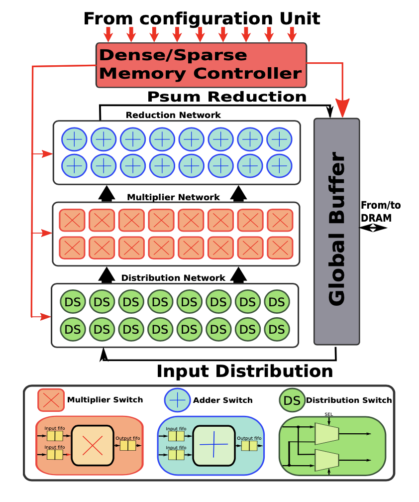

#### [HOME](README.md)           [Features](FEATURE.md)           [Documentation](DOCS.md)           [ASPLOS 2022 Tutorial](ASPLOSTUT.md)           [GNN-Dataflow](GNN.md)           [Codebase](https://github.com/stonne-simulator/stonne)           [Resources](RESOURCES.md)

# About STONNE

## DESIGN OF STONNE

 
STONNE is a cycle-level microarchitectural simulator for flexible DNN inference accelerators. To allow for end-to-end evaluations, the simulator is connected with a Deep Learning (DL) framework (Caffe and Pytorch DL frameworks in the current version). Therefore, STONNE can fully execute any dense and sparse DNN models supported by the DL framework that uses as its front-end.
 The simulator has been written entirely in C++, following the well-known GRASP and SOLID programming principles of object-oriented design. This has simplified its development and makes it easier the implementation of any kind of DNN inference accelerator microarchitecture, tile configuration mappings and dataflows.

The figure presented above shows a high-level view of STONNE with the three major modules involved in the end-to-end simulation flow.

## Flexible DNN Architecture

This constitutes the principal block of STONNE (see the central block in the figure), and it is mainly composed of the modeled microarchitecture of the flexible DNN accelerator (Simulation Engine) to simulate. The source code of this main block is the foundation of the simulator and is located in the 'stonne/src' folder. This contains different classes for the different components of the architecture as well as the principal class 'STONNEModel' which begins the execution of the simulator. This file contains the main functions to call the simulator and therefore can be view as the 'STONNE API' which is the manner in which the input module can interact with the simulated accelerator, configuring its simulation engine according to the user configuration file, enabling different execution modes such as LFF, loading a certain layer and tile, and transferring the weights and the inputs to the simulator memory.

## Input Module

Due to the flexibility that the \texttt{STONNE API} provides, the simulator can be fed easily using any of the well-known DL frameworks already available. Currently the simulator supports both Caffe and Pytorch DL frameworks and both front-ends with its connections are located in the folders 'pytorch-frontend' and 'caffe-frontend' respectively. Later in this file, we will explain how to install and run every framework on STONNE.

Furthermore, since these DL frameworks require a more complicated installation and use, apart from this mode of execution, we have also enabled the "STONNE User Interface" that facilitates the execution of STONNE. Through this mode, the user is presented with a prompt to load any layer and tile parameters onto a selected instance of the  simulator, and run it with random weights and input values. This allows for faster executions, facilitating rapid prototyping and debugging. This interface can be launched directly in the 'stonne' folder once compiled, and the code is located in 'src/main.cpp' file. Basically, it is a command line that according to hardware and dimensino parameters, allow to run the simulator with random tensors.

## Output module

 Once a simulation for a certain layer has been completed, this module is used for reporting simulation statistics such as performance, compute unit utilization, number of accesses to SRAM, wires and FIFOs, etc. Besides, this output module also reports the amount of energy consumed and the on-chip area required by the simulated architecture. These statistics obviously depend on the particular data format (e.g., fp16 or int8) utilized to represent the DNN model's parameters. So, STONNE supports different data formats in the whole end-to-end evaluation process and statistics report. For estimating both area and energy consumption, STONNE utilizes a table-based area and energy model, computing total energy using the cycle-level activity stats for each module. For the current table-based numbers existend in STONNE (see 'stonne/energy\_tables/' path), we ran synthesis using Synopsys Design-Compiler and place-and-route using Cadence Innovus on each module inside the MAERI and SIGMA RTL to populate the table. Users can plug in the numbers for their own implementations as well.

## SUPPORTED ARCHITECTURES	

STONNE models all the major components required to build both first-generation rigid accelerators and next-generation flexible DNN accelerators. All the on-chip components are interconnected by using a three-tier network fabric composed of a Distribution Network(DN), a Multiplier Network (MN), and a Reduce Network (RN), inspired by the taxonomy of on-chip communication flows within DNN accelerators. These networks can be configured to support any topology. An accelerator can be built from these as shown in the following figure-

Next, we describe the different topologies of the three networks (DN, MN and RN) currently supported in STONNE that are basic building blocks of state-of-the-art accelerators such as the Google’s TPU, Eyeriss-v2, ShDianNao, SCNN, MAERI and SIGMA, among others. These building blocks can also be seen in the figure presented below:

