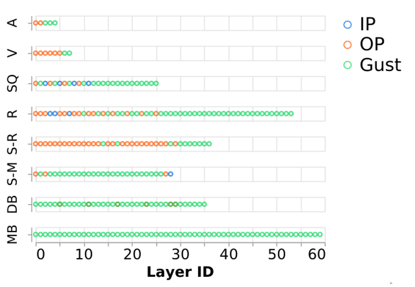
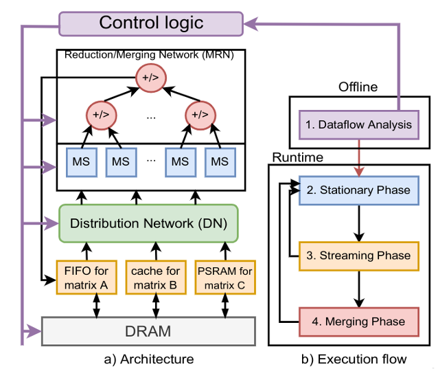

#### [HOME](README.md) &nbsp; &nbsp; &nbsp; [Features](FEATURE.md) &nbsp; &nbsp; &nbsp;  [Docs](DOCS.md) &nbsp; &nbsp; &nbsp; [ASPLOS 2023 Tutorial](ASPLOSTUT.md)  &nbsp; &nbsp; &nbsp;  [GNN-Dataflow](GNN.md)&nbsp; &nbsp; &nbsp;  [Code](https://github.com/stonne-simulator/stonne) &nbsp; &nbsp; &nbsp; [Resources](RESOURCES.md) &nbsp; &nbsp; &nbsp; [SST Integration](SST.md) &nbsp; &nbsp; &nbsp; [Flexagon](FLEXAGON.md)


# Flexagon

Sparsity is a growing trend in modern DNN models. Existing Sparse-Sparse Matrix Multiplication (SpMSpM) accelerators are tailored to a particular SpMSpM dataflow (i.e., Inner Product, Outer Product or Gustavsons), that determines their overall efficiency. We demonstrate that this static decision inherently results in a suboptimal dynamic solution. This is because different SpMSpM kernels show varying features (i.e., dimensions, sparsity pattern, sparsity degree), which makes each dataflow better suited to different data sets.

<p align="center">
 
</p>

In this work we present Flexagon, the first SpMSpM reconfigurable accelerator that is capable of performing SpMSpM computation by using the particular dataflow that best matches each case. Flexagon accelerator is based on a novel Merger-Reduction Network (MRN) that unifies the concept of reducing and merging in the same substrate, increasing efficiency. Additionally, Flexagon also includes a 3-tier memory hierarchy, specifically tailored to the different access characteristics of the input and output compressed matrices.

<p align="center">
 
</p>

# Flexagon Artifacts

We model Flexagon in [SST-STONNE](SST.md).

### Up to date docker image

docker run -it stonnesimulator/stonne-simulators

### Video

https://www.youtube.com/watch?v=GbbdnrTdnEo&t=8295s 


# Resources

### Publication

Francisco Muñoz-Martínez, Raveesh Garg, Michael Pellauer, José L. Abellán, Manuel E. Acacio, and Tushar Krishna. 2023. Flexagon: A Multi-dataflow Sparse-Sparse Matrix Multiplication Accelerator for Efficient DNN Processing. In Proceedings of the 28th ACM International Conference on Architectural Support for Programming Languages and Operating Systems, Volume 3 (ASPLOS 2023). Association for Computing Machinery, New York, NY, USA, 252–265. https://doi.org/10.1145/3582016.3582069 .[(pdf)](https://arxiv.org/pdf/2301.10852.pdf)

### BibTex

### Flexagon

```
@inproceedings{munoz2023flexagon,
  title={Flexagon: A Multi-Dataflow Sparse-Sparse Matrix Multiplication Accelerator for Efficient DNN Processing},
  author={Mu{\~n}oz-Mart{\'\i}nez, Francisco and Garg, Raveesh and Pellauer, Michael and Abell{\'a}n, Jos{\'e} L and Acacio, Manuel E and Krishna, Tushar},
  booktitle={Proceedings of the 28th ACM International Conference on Architectural Support for Programming Languages and Operating Systems, Volume 3},
  pages={252--265},
  year={2023}
}
```

