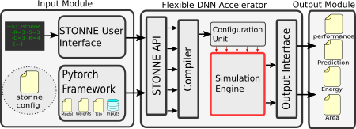

[Documentation](DOCS.md)      
[Features](FEATURE.md)

# STONNE: A Simulation Tool for Neural Networks Engines

## WHAT IS STONNE
The design of specialized architectures for accelerating the inference procedure of Deep Neural Networks (DNNs) is a booming area of research nowadays. While first-generation accelerator proposals used simple fixed dataflows tailored for 
dense DNNs, more recent architectures have argued for flexibility to efficiently support a wide variety of layer types, dimensions, and sparsity. As the complexity of these accelerators grows, it becomes more and more appealing for researchers to have cycle-level simulation tools at their disposal to allow for fast and accurate design-space exploration, and rapid quantification of the efficacy of architectural enhancements during the early stages of a design. To this end, we present STONNE (Simulation TOol of Neural Network Engines), a cycle-level, highly-modular and highly-extensible simulation framework that can plug into any high-level DNN framework as an accelerator device and perform end-to-end evaluation of flexible accelerator microarchitectures with sparsity support, running complete DNN models.


## DESIGN OF STONNE



STONNE is a cycle-level microarchitectural simulator for flexible DNN inference accelerators. To allow for end-to-end evaluations, the simulator is connected with a Deep Learning (DL) framework (Caffe and Pytorch DL frameworks in the current version). Therefore, STONNE can fully execute any dense and sparse DNN models supported by the DL framework that uses as its front-end.
 The simulator has been written entirely in C++, following the well-known GRASP and SOLID programming principles of object-oriented design. This has simplified its development and makes it easier the implementation of any kind of DNN inference accelerator microarchitecture, tile configuration mappings and dataflows.

The figure presented above shows a high-level view of STONNE with the three major modules involved in the end-to-end simulation flow:


## Bibtex Citation
Please, if you use STONNE, please cite us:
```
@INPROCEEDINGS{STONNE21,
  author =       {Francisco Mu{\~n}oz-Matr{\'i}nez and Jos{\'e} L. Abell{\'a}n and Manuel E. Acacio and Tushar Krishna},
  title =        {STONNE: Enabling Cycle-Level Microarchitectural Simulation for DNN Inference Accelerators},
  booktitle =    {2021 IEEE International Symposium on Workload Characterization (IISWC)}, 
  year =         {2021},
  volume =       {},
  number =       {},
  pages =        {},
}
```
