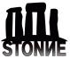
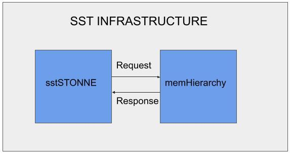

#### [HOME](README.md) &nbsp; &nbsp; &nbsp; [Features](FEATURE.md) &nbsp; &nbsp; &nbsp;  [Docs](DOCS.md) &nbsp; &nbsp; &nbsp; [ASPLOS 2023 Tutorial](ASPLOSTUT.md)  &nbsp; &nbsp; &nbsp;  [GNN-Dataflow](GNN.md)&nbsp; &nbsp; &nbsp;  [Code](https://github.com/stonne-simulator/stonne) &nbsp; &nbsp; &nbsp; [Resources](RESOURCES.md) &nbsp; &nbsp; &nbsp; [SST Integration](SST.md)





# Structural Simulation Toolkit (SST)

#### Copyright (c) 2009-2021, National Technology and Engineering Solutions of Sandia, LLC (NTESS)
Portions are copyright of other developers:
See the file CONTRIBUTORS.TXT in the top level directory
of this repository for more information.

---

The Structural Simulation Toolkit (SST) was developed to explore innovations in highly concurrent systems where the ISA, microarchitecture, and memory interact with the programming model and communications system. The package provides two novel capabilities. The first is a fully modular design that enables extensive exploration of an individual system parameter without the need for intrusive changes to the simulator. The second is a parallel simulation environment based on MPI. This provides a high level of performance and the ability to look at large systems. The framework has been successfully used to model concepts ranging from processing in memory to conventional processors connected by conventional network interfaces and running MPI.

Visit [sst-simulator.org](http://sst-simulator.org) to learn more about SST.

---

# SST-STONNE Element

STONNE has been integrated as a component called sstStonne in SST. sstStonne connects to memHierarchy component to faithfully model the memory hierarchy of the accelerator. A schematic view of sstStonne is presented below:

<p>

</p>

## Codebase

Github repository - [https://github.com/stonne-simulator/sst-elements-with-stonne](https://github.com/stonne-simulator/sst-elements-with-stonne)

## How to install sstStonne

Please install sst-elements-with-stonne following the installation description presented in [sst-simulator.org](http://sst-simulator.org). 

## How to run sstStonne

sstStonne must be instanstiated in the SST Configuration file, along with the memory hierarchy components and subcomponents that will be used to model the memory hierarchy. Please refer to our examples for further information:

- sst configuration file to run a convolution operation: tests/sst_stonne_conv.py
- sst configuration file to run a dense GEMM operation: tests/sst_stonne_gemm.py
- sst configuration file to run a sparse-sparse GEMM operation where the matrices are encoded using a bitmat format: tests/sst_stonne_bitmapSpMSpM.py
- sst configuration file to run a sparse-dense GEMM operation where the sparse matrix is encoded using a CSR format: tests/sst_stonne_csrSpMM.py

Also, refer to our scripts to generate the memory initialization files and calculate the memory address locations: 
- Script for convolution operation: tests/gen_conv.py
- Script for dense GEMM operation: tests/gen_gemm.py
- Script for sparse-sparse GEMM operation where the matrices are encoded using a bitmat format: tests/gen_bitmapSpMSpM.py

Please remember to update the SST configuration file with the proper memory address locations and the proper memory intialization file for each kernel to be launched. 

# Citations
Please if you use sstStonne component cite us: 

```
@INPROCEEDINGS{STONNE21,
  author =       {Francisco Mu{\~n}oz-Matr{\'i}nez and Jos{\'e} L. Abell{\'a}n and Manuel E. Acacio and Tushar Krishna},
  title =        {STONNE: Enabling Cycle-Level Microarchitectural Simulation for DNN Inference Accelerators},
  booktitle =    {2021 IEEE International Symposium on Workload Characterization (IISWC)}, 
  year =         {2021},
  volume =       {},
  number =       {},
  pages =        {},
}
```

